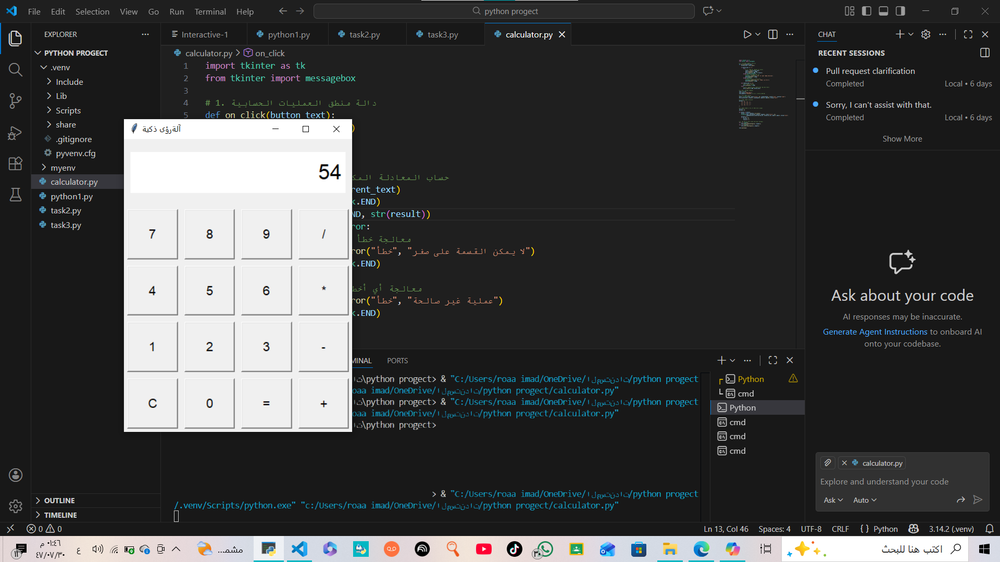

# 🧮 GUI Calculator - Python



## 📝 وصف المشروع
آلة حاسبة احترافية بواجهة رسومية (GUI) تم بناؤها باستخدام لغة **Python** ومكتبة **Tkinter**.

## 🚀 المميزات
* **واجهة جذابة:** تصميم سهل ومريح للعين.
* **العمليات الأساسية:** جمع، طرح، ضرب، وقسمة.
* **معالجة الأخطاء:** البرنامج لا يتوقف عند القسمة على صفر.

## 💻 طريقة التشغيل
1. تأكد من تثبيت Python على جهازك.
2. قم بتشغيل الملف:
   ```bash
   python calculator.py
